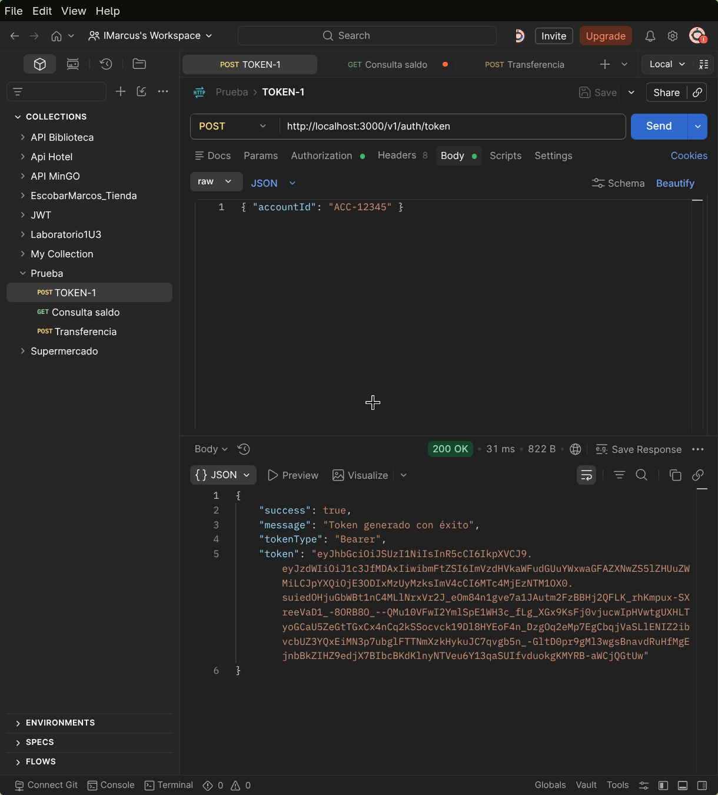
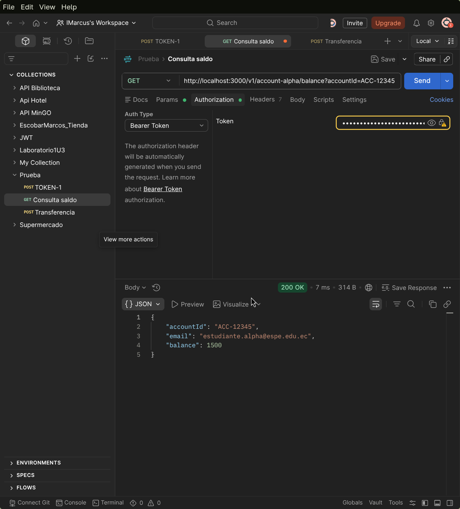
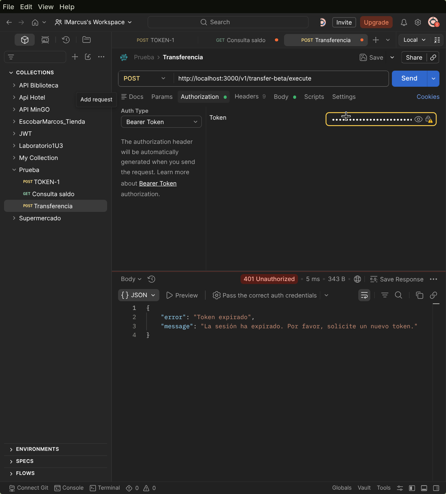
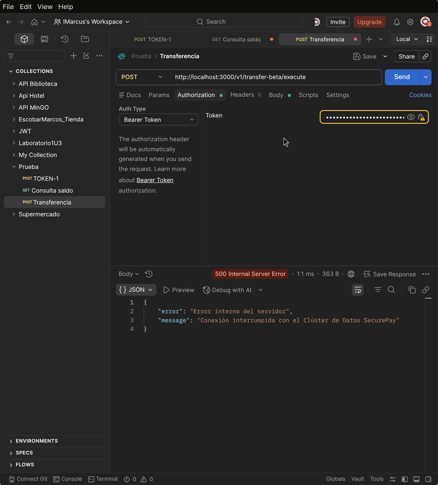
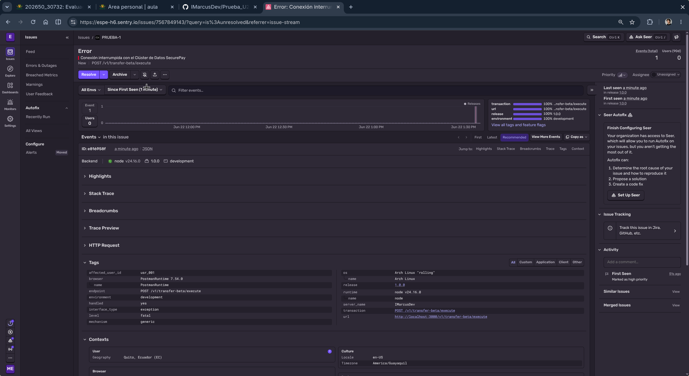

## Captura 1: Generar el token

## Captura 2: Acceso válido con el token

## Captura 3: Acceso con token expirado

## Captura 4: Error operacional 500 (transferencia)

## Captura 5: Sentry - Error operacional con Tags de usuario

